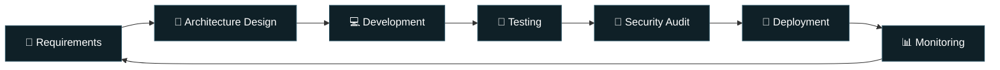

<div align="center">

<!-- HEADER ANIMADO -->


<!-- TYPING SVG -->
<a href="https://git.io/typing-svg">
  
</a>

<br/>

<!-- BADGES DE PERFIL -->


</div>

<br/>

<!-- SEPARADOR -->


##  &nbsp;About Me

```yaml
name: Arnold Huaman Zamora
role: AI Systems Engineer & Full Stack Developer
location: Lima, Peru 🇵🇪
education: Software Engineering
languages: [Spanish 🇪🇸, English 🇺🇸, Quechua 🟡🔴🟢]

current_focus:
  - AI model training & optimization
  - Scalable production systems
  - Cybersecurity & automation
  - Clean architecture & best practices

motto: "Intelligence must scale. Security is never optional."
```

<br/>

<div align="center">

<!-- GITHUB STATS -->
## 📊 GitHub Analytics

<p>
  
  
</p>


</div>

<br/>


## 🧠 Tech Stack & Tools

### 🤖 AI / Machine Learning / Data Science

<p align="left">
  
  
  
  
  
  
  
  
  
</p>

### 🌐 Frontend Development

<p align="left">
  
  
  
  
  
  
  
  
</p>

### ⚙️ Backend & APIs

<p align="left">
  
  
  
  
  
  
</p>

### 🗄️ Databases

<p align="left">
  
  
  
  
  
</p>

### 🔐 Security & DevOps

<p align="left">
  
  
  
  
  
  
  
  
</p>

### 🛠️ Tools & Platforms

<p align="left">
  
  
  
  
  
  
</p>

<br/>


## 🚀 Featured Projects

<div align="center">

<a href="https://github.com/arnoldhuamanzamora/mi-bodega-digital">
  
</a>

</div>

<br/>

<table align="center">
<tr>
<td width="50%" valign="top">

### 🏪 Mi Bodega Digital
> Sistema de gestión para bodegas con interfaz moderna, control de inventario, ventas y reportes en tiempo real.

**Tech:** `Angular` `TypeScript` `Node.js` `PostgreSQL`

**Features:**
- 📦 Gestión de inventario inteligente
- 💰 Sistema de ventas y facturación
- 📊 Dashboard con analytics en tiempo real
- 🔐 Autenticación segura con JWT

</td>
<td width="50%" valign="top">

### 🧠 AI Projects
> Modelos de inteligencia artificial para clasificación, predicción y procesamiento de lenguaje natural.

**Tech:** `Python` `TensorFlow` `PyTorch` `Scikit-Learn`

**Features:**
- 🤖 Entrenamiento y optimización de modelos
- 📈 Análisis predictivo de datos
- 🗣️ Procesamiento de lenguaje natural
- 👁️ Computer Vision con OpenCV

</td>
</tr>
</table>

<br/>


## 🏗️ Architecture & Methodology

<div align="center">


```mermaid
graph LR
    A[🎯 Requirements] --> B[📐 Architecture Design]
    B --> C[💻 Development]
    C --> D[🧪 Testing]
    D --> E[🔐 Security Audit]
    E --> F[🚀 Deployment]
    F --> G[📊 Monitoring]
    G --> A
    
    style A fill:#0f2027,stroke:#2c5364,color:#fff
    style B fill:#0f2027,stroke:#2c5364,color:#fff
    style C fill:#0f2027,stroke:#2c5364,color:#fff
    style D fill:#0f2027,stroke:#2c5364,color:#fff
    style E fill:#0f2027,stroke:#2c5364,color:#fff
    style F fill:#0f2027,stroke:#2c5364,color:#fff
    style G fill:#0f2027,stroke:#2c5364,color:#fff
```

</div>

<br/>


## 🧩 Engineering Philosophy

<div align="center">

| Principle | Description |
|:---------:|:------------|
| 🧠 **Intelligence must scale** | Systems should grow smarter, not just bigger |
| 🧹 **Code must be maintainable** | Clean code today saves hours tomorrow |
| 🔐 **Security is never optional** | Every layer, every endpoint, every time |
| ⚡ **Automation beats repetition** | If you do it twice, automate it |
| 🌍 **Culture & tech coexist** | Technology should serve people and communities |
| 📐 **Architecture first** | Good design prevents bad code |

</div>

<br/>


## 🌎 Languages I Speak

<div align="center">

| Language | Proficiency |
|:--------:|:-----------:|
| 🇪🇸 **Español** | ████████████████████ Native |
| 🇺🇸 **English** | ████████████████░░░░ Professional |
| 🟡🔴🟢 **Quechua** | ████████████░░░░░░░░ Conversational |

</div>

<br/>


## 🤝 Let's Connect

<div align="center">

<a href="https://www.linkedin.com/in/arnold-huaman/">
  
</a>
&nbsp;
<a href="mailto:huamanzamoraarnold@gmail.com">
  
</a>
&nbsp;
<a href="https://github.com/arnoldhuamanzamora">
  
</a>

<br/><br/>

### 💬 Open to collaborations on AI, Full Stack, and Security projects!

<br/>

<!-- CONTRIBUTION GRAPH -->


<br/><br/>

<!-- SNAKE ANIMATION -->
<picture>
  <source media="(prefers-color-scheme: dark)" srcset="https://raw.githubusercontent.com/arnoldhuamanzamora/arnoldhuamanzamora/output/github-snake-dark.svg" />
  <source media="(prefers-color-scheme: light)" srcset="https://raw.githubusercontent.com/arnoldhuamanzamora/arnoldhuamanzamora/output/github-snake.svg" />
  
</picture>

<br/><br/>

<!-- QUOTE -->


<br/><br/>

<!-- FOOTER -->


</div>

---

<div align="center">
  <sub>⚡ Built with passion from Lima, Peru 🇵🇪 | Last updated: 2026</sub>
</div>
